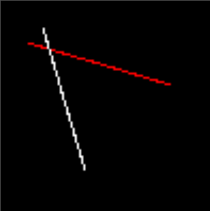
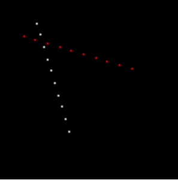
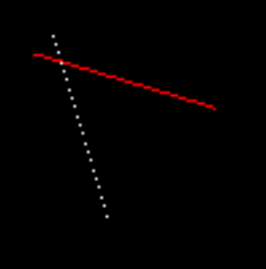
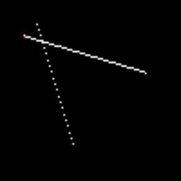
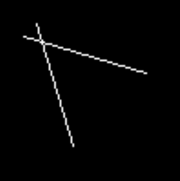
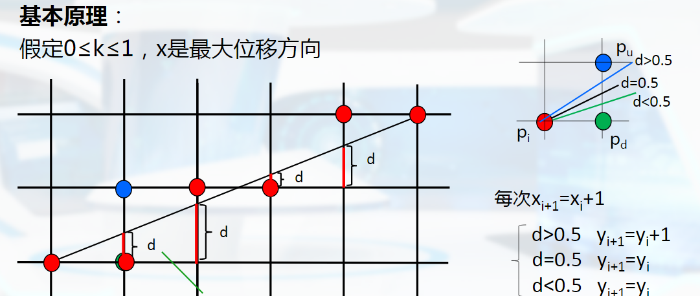
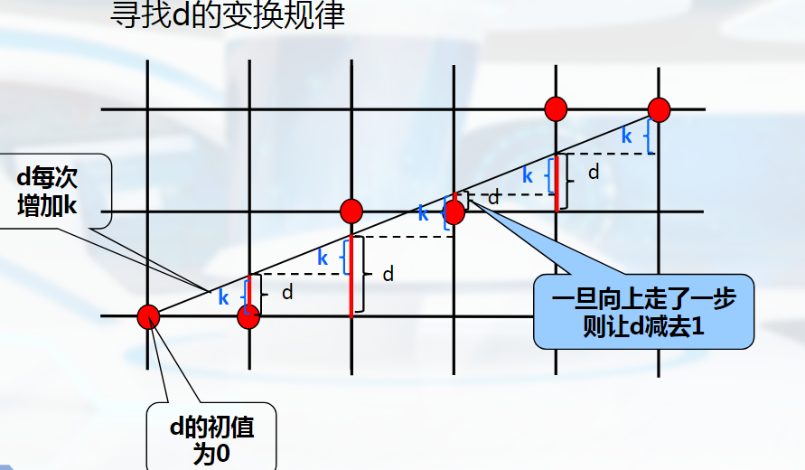

# 画线算法

## 简单的画线算法

根据直线方程两点式：

$$
\frac{(x - x_0)}{(x_1 - x_0)}   = \frac{(y - y_0)}{(y_1 - y_0)} = t, t \in [0, 1]
$$
那么有：
$$
x = t * (x_1 - x_0) + x_0 = (1- t) * x_0 + x_1 \\ 
y = t * (y_1 - y_0) + y_0 = (1- t) * y_0 + y_1
$$


则画线的算法代码为：

```cpp
void line(int x0, int y0, int x1, int y1, TGAImage& image, const TGAColor& color)
{
	float dt = 0.01;
	for (float t = 0; t <= 1.0; t += dt)
	{
		int x = (1 - t) * x0 + t * x1;
		int y = (1 - t) * y0 + t * y1;
		image.set(x, y, color);
	}
}
```

上述代码绘制效果：



当`dt = 0.1`时，画出的却是一些离散的点：



上述算法缺点：

+ 效率比较低，有比较多浮点数运算
+ `dt`取值太小容易出现重复计算，`dt`太大会出现断裂

如何确定一个合适的步长`dt`呢？

+ 很明显它和我们需要绘制多少个像素相关： 我们的步长每次增加一个像素长度，那么我们可以写出下面的代码：

  ```cpp
  void line(int x0, int y0, int x1, int y1, TGAImage& image, const TGAColor& color)
  {
  	// 线性插值: 已知x求解y
  	// (x - x0) / (x1 - x0) = (y - y0) / (y1- y0) = t
  	// => y = t * (y1 - y0) + y0 = (1 - t) * y0 + t * y1
  	for (int x = x0; x <= x1; ++x)
  	{
  		float t = (x - x0) / static_cast<float>(x1 - x0);
  		int y = (1.0f - t) * y0 + t * y1;
  		image.set(x, y, color);
  	}
  }
  ```

  上述代码绘制效果：

  ```cpp
  	// 以下所有绘制直线都采用这三行代码测试
  	line(13, 20, 80, 40, image, red);
  	line(20, 13, 40, 80, image, white);
  	line(80, 40, 13, 20, image, white);
  ```

  

  

  结果分析：

  + 第二条比较陡峭的白线没有达到预期出现了断裂: 由于$|dx| < |dy|$, $x$每增加1，$y$需要变化比较大
  + 第三条实际上是和第一条一样的线，只是方向不一样却没有绘制出来，否则应该会覆盖掉第一条红色的线

  修复后代码：（由后面DDA算法的实现，可以看出下方代码可以说是DDA的另一种实现，不同点只是借助线性插值的方式计算出增量后的y）

  ```cpp
  void line(int x0, int y0, int x1, int y1, TGAImage& image, const TGAColor& color)
  {
  	bool steep = false;
  	if (abs(x0 - x1) < abs(y0 - y1))// |dx| < |dy|， 转置
  	{
  		steep = true;
  		std::swap(x0, y0);
  		std::swap(x1, y1);
  	}
  	if (x0 > x1) // 起点到终点为从左到右
  	{
  		std::swap(x0, x1);
  		std::swap(y0, y1);
  	}
  	// 线性插值: 已知x求解y
  	// (x - x0) / (x1 - x0) = (y - y0) / (y1- y0) = t
  	// => y = t * (y1 - y0) + y0 = (1- t) * y0 + t * y1
  	for (int x = x0; x <= x1; ++x)
  	{
  		float t = (x - x0) / static_cast<float>(x1 - x0);
  		int y = (1.0f - t) * y0 + t * y1;
  		if (steep)
  		{
  			image.set(y, x, color); // 转置回来
  		}
  		else
  		{
  			image.set(x, y, color);
  		}
  	}
  }
  ```

性能分析：

+ pass

+ 循环内有较多浮点数运算，效率比较低。

## DDA 算法

> 数值微分法:(Digital Differential Analyzer) DDA

我们从直线截距式来看：
$$
y = kx + b \\ 
同时有：x = (y-b) / k
$$

很明显有： 

+ 当$x$增量为$1$时，$y$增量为$k = dy/dx$; 
+ 当$y$增量为$1$时， $x$增量为$1/k = dx/dy$ 。

```cpp
void line(int x0, int y0, int x1, int y1, TGAImage& image, const TGAColor& color)
{
	int dx = x1 - x0;
	int dy = y1 - y0;
	int steps = abs(dx);
	float x = x0;
	float y = y0;
	float incx = dx / static_cast<float>(steps);
	float incy = dy / static_cast<float>(steps);
	for (int i = 0; i <= steps; ++i) // 由于第一个点画的是起点，所以从0开始
	{
		image.set(x, y, color);
		x += incx;
		y += incy;
	}
}
```

上述代码绘制结果：

上面代码是$x$每次增量$1$，$y$每次增量$k$。发现$|dy| > |dx|$时会出现断裂情况， 当然我们依然可以像上面的交换并转置来解决这个问题。但是这里我们可以采用另外一种解决办法：我们向**最大位移方向**($|dx| > |dy|$ 则$x$，否则$y $)每次增量1。(除此之外，覆盖绘制不同颜色，左上角有点瑕疵，对绘制的像素**坐标x,y四舍五入取整逼近最近像素点**后就没有这个问题) 具体实现：

```cpp
void line(int x0, int y0, int x1, int y1, TGAImage& image, const TGAColor& color)
{
	int dx = x1 - x0;
	int dy = y1 - y0;
	int steps = std::max(std::abs(dx), std::abs(dy)); // 取最大位移方向：最大位移方向每次增加1
	float x = x0;
	float y = y0;
	float incx = dx / static_cast<float>(steps);
	float incy = dy / static_cast<float>(steps);
	for (int i = 0; i <= steps; ++i) // 由于第一个点画的是起点，所以从0开始
	{
		image.set(static_cast<int>(x+0.5), static_cast<int>(y+0.5), color); // +0.5取整比调用std::round效率高
		x += incx;
		y += incy;
	}
}
```

绘制效果：




性能分析：

+ pass

+ 消除了循环内部分浮点数运算，性能略有提升。


## Bresenham算法

### 中点的Bresenham算法

讨论一个简化的问题： 假设当前直线斜率$k \in [0, 1]$, 最大位移方向为$x$(始终有$|dx| > |dy|$,如果不满足 代码实现上可交换$x$和$y$来满足此条件), 已知当前点$(x, y)$, 如何取下一个点？

+ 其实很明显，我们的下一个最佳逼近点只有两个候选点：

$$
p_d = (x+1, y) \\
p_u = (x+1, y+1)
$$


那到底取哪一个点呢？

+ 哪个理论上离直线近就取哪一个。具体的我们可以这样评估： 
  +  取两个候选点的中点$p_m = (x + 1, y + 0.5)$
  + 如果中点$p_m$在直线上方，则直线离$p_d$更近, 取$p_d $；

  + 如果中点$p_m$在直线下方， 则直线离$p_u$更近, 取$p_u$；
  
  + 如果在直线上，那可以随意取其一。
+ 判断在直线上方还是下方，我们可以使用直线的隐式方程：
$$
f(x, y) = y - kx - b
$$
+ $f(x, y) > 0$:  $(x, y)$在直线上方 
+ $f(x, y) < 0$: $ (x, y)$ 在直线下方 
+ $f(x, y) = 0$, $(x, y)$ 在直线上     

+ 如果直线斜率$k \in [-1,0]$, 那么候选点为：$p_u = (x+1, y )$, $p_d = (x+1, y - 1)$, 中点$p_m = (x+1, y-0.5)$在直线上方时取$p_d = (x+1, y - 1)$

根据上方思路写出代码：

```cpp
void line(int x0, int y0, int x1, int y1, TGAImage& image, const TGAColor& color)
{
	bool steep = false;
	if (abs(x0 - x1) < abs(y0 - y1))// |dx| < |dy|， 转置
	{
		steep = true;
		std::swap(x0, y0);
		std::swap(x1, y1);
	}
	if (x0 > x1) // 起点到终点为从左到右
	{
		std::swap(x0, x1);
		std::swap(y0, y1);
	}
    // 以下逻辑为斜率k: 0 <= k <= 1
	int dx = x1 - x0;
	int dy = y1 - y0;
	float k = static_cast<float>(dy) / dx;  
	float b = y0 - k * x0;
	auto Fxy = [&](float x, float y)
	{
		return y - k * x - b;
	};
	const float eps = 1e-4;
	for (int x = x0, y = y0; x <= x1; ++x)
	{
		if (steep)
		{
			image.set(y, x, color); // 转置回来
		}
		else
		{
			image.set(x, y, color);
		}
		// 候选点:(x+1, yi),(x+1, y+1)
        // 两个候选点的中点(x + 1, y + 0.5)在直线下方，那么理论上直线离(x+1, y+1)更近
		if (Fxy(x + 1, y + 0.5) < eps) 
		{
			y = y + 1;
		}
	}
}

```

代码分析：上方循环内计算`Fxy`为复杂的浮点数运算，而且判别比0大还是小还是浮点数比较。在性能上比不上DDA。

实际上我们只需要知道判别式`Fxy`的符号， 如何来优化呢？

当$k \in [0, 1]$, 我们先看看判别项$d = f(x_m, y_m)$的规律：
$$
d = f(x_m, y_m) = f(x_i + 1,y_i + 0.5) = y_i + 0.5 - k(x_i + 1) - b
$$
+ $d < 0$ , 取$(x_i + 1, y_i + 1)$, 那下一个判别项：
$$
  d = f(x_i + 2, y_i + 1.5) = y_i + 1.5 - k(x_i + 2) - b 
  = y_i + 0.5 - k(x_i + 1) - b + 1 - k  = d - k + 1
$$
+ $d >= 0$, 取$(x_i + 1, y_i)$, 那下一个判别项：
$$
d = f(x_i + 2, y_i + 0.5) = y_i + 0.5 - k(x_i + 2) - b = y_i + 0.5 - k(x_i + 1) - b - k
= d - k \\
$$
+ $d$的初始值：
$$
  d_0 = f(x_0 + 1, y_0 + 0.5) = y_0 + 0.5 - k(x_0 + 1) - b = y_0 - kx_0 - b + 0.5 - k = f(x_0, y_0) + 0.5-k = 0.5 - k
$$
上方只有$0.5$和$k$两个浮点数，$k = dy / dx$, 我们可以对浮点数的项同时扩大$2 * dx$倍：
$$
d的初值:d_0 = dx - 2dy\\
d < 0: d = d + 2dx - 2dy\\
d >=0: d = d - 2dy
$$
+ $k \in [-1, 0]$ 时：

  + 候选点为$(x+1, y), (x+1 y -1)$

  + 判别项:
$$
    d = f(x_m, y_m) = f(x_i+1, y_i-0.5) = y_i - 0.5 - k(x_i+1) - b
$$


  + $d > 0$时，取$(x + 1, y - 1)$, 那下一个判别项:
    $$
    d = f(x_i + 2, y_i - 1.5) = d - k - 1
    $$

  + $d <= 0$时，取$(x + 1, y)$, 那下一判别项：
    $$
    d = f(x_i + 2, y_i - 0.5) = d - k
    $$

  + $d$的初值：
    $$
    d_0 = f(x0 + 1, y - 0.5) = -0.5 - k
    $$
    
  + 有浮点数的项同时扩大$2 * dx$倍：

$$
d的初值:d_0 = -dx - 2dy\\
  d > 0: d = d - 2dy - 2dx\\
  d <=0: d = d - 2dy
$$

那么优化后的代码如下：

```cpp
void line(int x0, int y0, int x1, int y1, TGAImage& image, const TGAColor& color)
{
	bool steep = false;
	if (abs(x0 - x1) < abs(y0 - y1))// |dx| < |dy|， 转置
	{
		steep = true;
		std::swap(x0, y0);
		std::swap(x1, y1);
	}
	if (x0 > x1) // 起点到终点为从左到右
	{
		std::swap(x0, x1);
		std::swap(y0, y1);
	}
    // 以下逻辑为斜率k: 0 <= k <= 1
	int dx = x1 - x0;
	int dy = y1 - y0;
    const int twoDx = 2 * dx;
    const int twoDy = 2 * dy;
	int d = dx - twoDx;
	for (int x = x0, y = y0; x <= x1; ++x)
	{
		if (steep)
		{
			image.set(y, x, color); // 转置回来
		}
		else
		{
			image.set(x, y, color);
		}
		if (d < 0)
		{
			y = y + 1;
			d = d + twoDx - twoDy;
		}
		else
		{
			d = d - twoDy;
		}
		
	}
}
```


### 改进的Bresenham算法

+ 不使用中点，而是直接使用交点：以直线**与每个像素格子的交点** 和 **相交像素格子右下角点** 的距离 作为判别项$d$。






综上：

+ 判别项$d$初值:$d_0 = 0$
+ 递推规律： $d = d + k$
+ 当 $d > 0.5$, 选择$p_u = (x + 1, y + 1)$， 同时$d = d - 1$
+ 当$d <= 0.5$, 选择$p_d = (x + 1, y)$

发现出现$0.5$和$k$这两个浮点数, 对于$0.5$， 我们可以令$d$的初值：$d_0 = -0.5$ ，那么此时转化为$d$与0的比较

此时$d = d + k$ 和$d = d - 1$依然存在浮点数计算（$d$初值-0.5，$k = dy/ dx$），我们可以让与浮点数相关项同时扩大$2*dx$倍用来消除浮点数, 那么就有：

+ $d$的初值： $d_0 = -dx$
+ $d$的递推规律： $d = d + 2dy$
+ 当 $d > 0$, 选择$p_u = (x + 1, y + 1)$， 同时$d = d - 2dx$
+ 当$d <= 0$, 选择$p_d = (x + 1, y) $

当$k \in [-1,0]$时，递推判别项$d = d - k$, 然后将上述$(x + 1, y + 1)$ 替换成$(x + 1, y -1)$即可

根据上述优化思路写出代码：

```cpp
void line(int x0, int y0, int x1, int y1, TGAImage& image, const TGAColor& color)
{
	bool steep = false;
	if (abs(x0 - x1) < abs(y0 - y1))// |dx| < |dy|， 转置
	{
		steep = true;
		std::swap(x0, y0);
		std::swap(x1, y1);
	}
	if (x0 > x1) // 起点到终点为从左到右
	{
		std::swap(x0, x1);
		std::swap(y0, y1);
	}
    // 以下逻辑为斜率k: 0 <= k <= 1
	int dx = x1 - x0;
	int dy = y1 - y0;
	int d = -dx;
    const int twoDx = 2 * dx;
    const int twoDy = 2 * dy;
	for (int x = x0, y = y0; x <= x1; ++x)
	{
		if (steep)
		{
			image.set(y, x, color); // 转置回来
		}
		else
		{
			image.set(x, y, color);
		}
		d = d + twoDy;
		if (d > 0)
		{
			y = y + 1;
			d = d - twoDx;
		}
	}
}

```


## 参考资料：

+ [中国mooc: 华中科技大学《计算机图形学》](https://www.icourse163.org/course/HUST-1003636001)