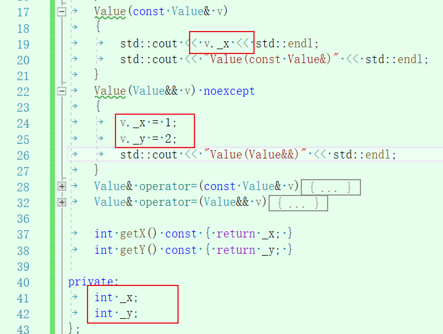

## 疑问
突然写了上方这样的代码，然后居然没有报错。让我产生了疑问：
private成员不是不允许外部访问吗？这么为什么这里可以直接访问？难道外部是指非本身类内？

## 解答
+ 封装是编译期的概念，是**针对类型而非对象**的，在类的成员函数中是可以访问同类型实例对象的私有成员变量的。
+ [ref](https://www.cnblogs.com/woshizhizhong-tech/p/8450475.html)

